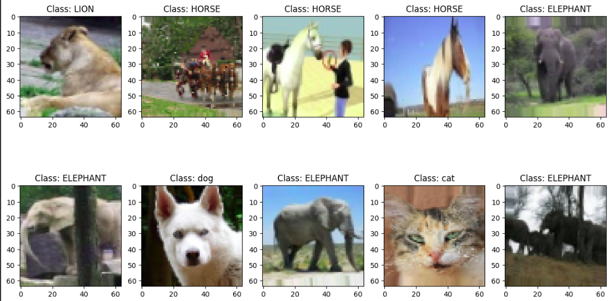
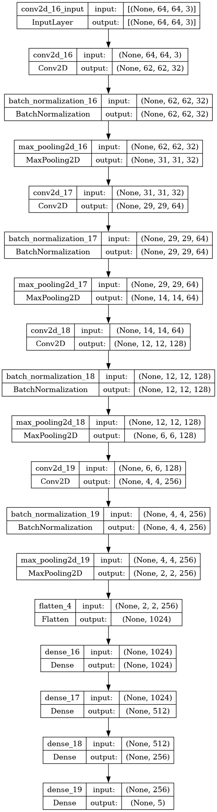
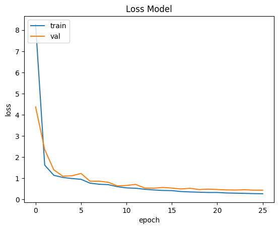
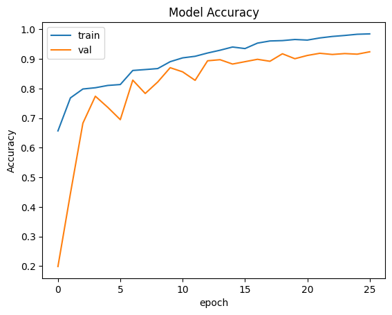

# 🐾 Mammal Image Classification with Convolutional Neural Networks

Notebook: [Mammal Image Classification with Convolutional Neural Networks](mammal_image_classification_using_cnn_92_acc.ipynb)

## 🎯 Project Goal

The aim of this project is to classify images of mammals using Convolutional Neural Networks (CNNs). We're using the [Mammals dataset](https://www.kaggle.com/datasets/shiv28/animal-5-mammal/data?select=Animal) from Kaggle, which contains a total of 14,997 images.

## 🦁 Dataset Details

This dataset is divided into 5 categories:

- 🐘 Elephant: 3,040 Images
- 🐎 Horse: 3,009 Images
- 🦁 Lion: 2,984 Images
- 😺 Cat: 3,037 Images
- 🐶 Dog: 2,927 Images



The dataset is split into training and testing sets.

## 🧠 Neural Network Architecture

This CNN model is structured as follows:

```python
model = tf.keras.models.Sequential([
    tf.keras.layers.Conv2D(32, (3,3), activation='relu', input_shape=(64,64,3), kernel_regularizer=tf.keras.regularizers.l2(0.01)),
    tf.keras.layers.BatchNormalization(),
    tf.keras.layers.MaxPooling2D(2,2),
    
    tf.keras.layers.Conv2D(64, (3,3), activation='relu', kernel_regularizer=tf.keras.regularizers.l2(0.01)),
    tf.keras.layers.BatchNormalization(),
    tf.keras.layers.MaxPooling2D(2,2),
    
    tf.keras.layers.Conv2D(128, (3,3), activation='relu', kernel_regularizer=tf.keras.regularizers.l2(0.01)),
    tf.keras.layers.BatchNormalization(),
    tf.keras.layers.MaxPooling2D(2,2),
    
    tf.keras.layers.Conv2D(256, (3,3), activation='relu', kernel_regularizer=tf.keras.regularizers.l2(0.01)),
    tf.keras.layers.BatchNormalization(),
    tf.keras.layers.MaxPooling2D(2,2),
    
    tf.keras.layers.Flatten(),
    
    tf.keras.layers.Dense(1024, activation='relu', kernel_regularizer=tf.keras.regularizers.l2(0.01)),
    tf.keras.layers.Dense(512, activation='relu', kernel_regularizer=tf.keras.regularizers.l2(0.01)),
    tf.keras.layers.Dense(256, activation='relu', kernel_regularizer=tf.keras.regularizers.l2(0.01)),
    
    tf.keras.layers.Dense(5, activation='softmax')
])
```



## 🛠️ Model Training

Implemented several callbacks to optimize the training process:

```python
class CustomAccuracyStop(tf.keras.callbacks.Callback):
    def __init__(self, target_accuracy):
        super(CustomAccuracyStop, self).__init__()
        self.target_accuracy = target_accuracy

    def on_epoch_end(self, epoch, logs=None):
        if logs.get('accuracy') is not None and logs.get('val_accuracy') is not None:
            if logs.get('accuracy') >= self.target_accuracy and logs.get('val_accuracy') >= self.target_accuracy:
                print(f"\nReached target accuracy of {self.target_accuracy}% on both training and validation. Stopping training.")
                self.model.stop_training = True

log_dir = "logs/fit/" + datetime.datetime.now().strftime("%Y%m%d-%H%M%S")

# Define Callbacks
custom_accuracy_stop = CustomAccuracyStop(target_accuracy=0.92)
checkpoint = ModelCheckpoint("mammal_classification.h5", monitor="val_accuracy", save_weights_only=False , save_best_only=True, mode="max")
early_stopping = EarlyStopping(monitor="val_loss", mode='min', min_delta=0.1, patience=10, restore_best_weights=True)
tensorboard_callback = tf.keras.callbacks.TensorBoard(log_dir=log_dir)
reduce_lr = ReduceLROnPlateau(monitor='val_accuracy', factor=0.5, patience=2, min_lr=1e-6, verbose=1)

# Compile the model
model.compile(optimizer=tf.optimizers.Adam(), loss='categorical_crossentropy', metrics=['accuracy'])
```

## 📊 Results

This model achieved an impressive accuracy of 92%!





Final training output:
```
Epoch 26/30
188/188 [==============================] - ETA: 0s - loss: 0.2691 - accuracy: 0.9848
Reached target accuracy of 0.92% on both training and validation. Stopping training.
188/188 [==============================] - 45s 237ms/step - loss: 0.2691 - accuracy: 0.9848 - val_loss: 0.4363 - val_accuracy: 0.9243 - lr: 1.5625e-05
```

## 🚀 Next Steps

- Experiment with different model architectures to potentially improve accuracy, and prevent from overfitting
- Use more options in data augmentation
- Explore transfer learning with pre-trained models like VGG16 or ResNet
- Create a web application for real-time mammal classification

## 🤝 Contribute

Feel free to fork this repository and submit pull requests. All contributions are welcome!

## 📚 Learn More

For a detailed walkthrough of the code and methodology, check out the Jupyter notebook in this repository.

---

If you find this project interesting, don't forget to give it a star! ⭐